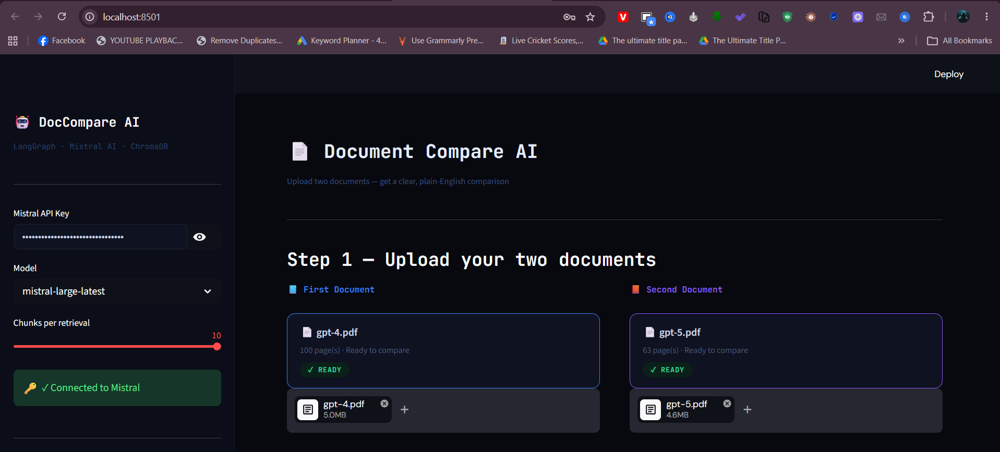
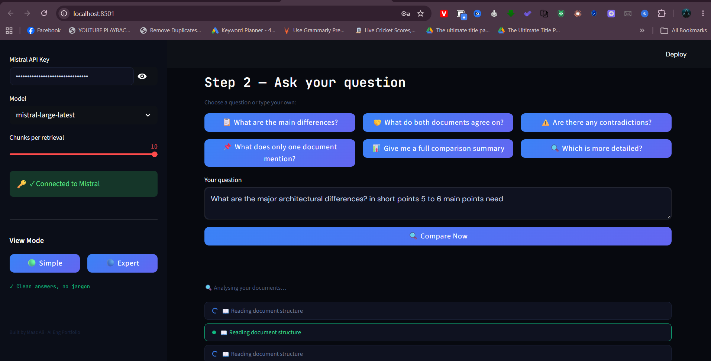
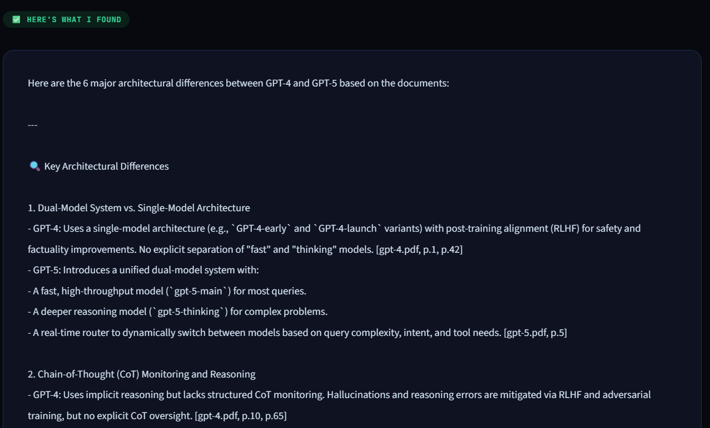
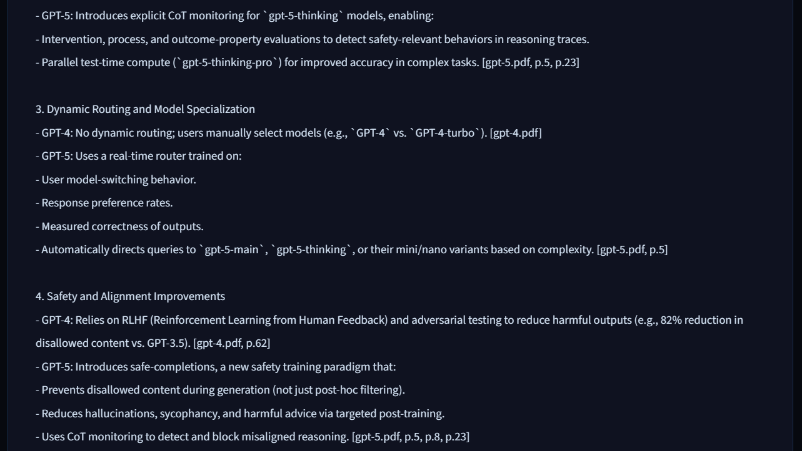
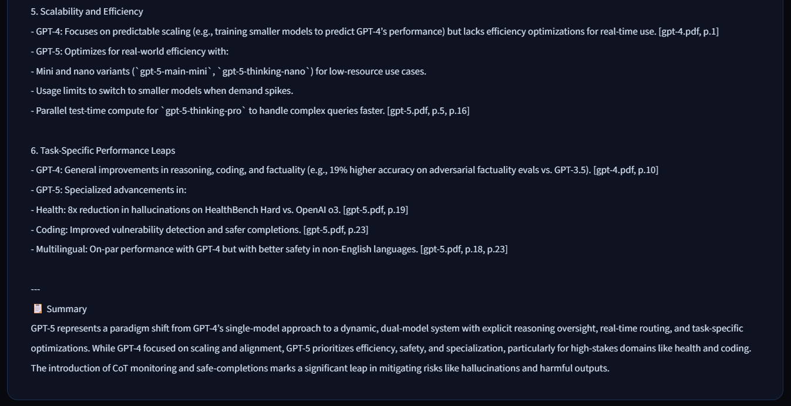

# 🤖 AI Document Comparison Agent (Agentic LangGraph Version)

> Agentic RAG — the AI autonomously decides what to search, how many times,
> and reasons step-by-step before producing a cited, structured answer.

---

## Why "agentic" vs simple RAG?

| Simple RAG (v1) | Agentic RAG (v2) |
|---|---|
| Always runs: retrieve A → retrieve B → LLM | **Decides** what to retrieve based on the question |
| Fixed 2-retrieval pipeline | Can call tools **5-10+ times**, refining queries each time |
| One prompt → one answer | **Reasoning loop**: Thought → Action → Observation → repeat |
| No awareness of what it doesn't know | Can say "I need to search X with a better query" |

---

## Architecture

```
                     ┌─────────────────────────────────┐
                     │     LangGraph ReAct Agent        │
                     │                                  │
User Query ─────────►│  Thought: "Let me first get      │
                     │  an overview of both docs..."    │
                     │            │                     │
                     │     ┌──────▼──────┐              │
                     │     │  Tool Call  │              │
                     │     │ get_doc_    │              │
                     │     │ overview()  │              │
                     │     └──────┬──────┘              │
                     │            │ Observation          │
                     │  Thought: "Now I'll compare      │
                     │  the methodology sections..."    │
                     │            │                     │
                     │     ┌──────▼──────┐              │
                     │     │  Tool Call  │              │
                     │     │ compare_    │              │
                     │     │ topic()     │              │   ◄── Mistral Embed
                     │     └──────┬──────┘              │       ChromaDB A
                     │            │ Observation          │       ChromaDB B
                     │  Thought: "There's a conflict,   │
                     │  let me investigate..."          │
                     │            │                     │
                     │     ┌──────▼──────┐              │
                     │     │  Tool Call  │              │
                     │     │ find_       │              │
                     │     │ conflicts() │              │
                     │     └──────┬──────┘              │
                     │            │                     │
                     │     Final Answer (Mistral Large) │
                     └─────────────────────────────────┘
```

---

## 6 Agent Tools

| Tool | Purpose | When agent uses it |
|---|---|---|
| `search_document_a` | Semantic search in Doc A | Targeted evidence gathering |
| `search_document_b` | Semantic search in Doc B | Targeted evidence gathering |
| `compare_topic` | Parallel search in both docs | Primary comparison tool |
| `find_conflicts` | Multi-angle contradiction search | Disagreement detection |
| `find_common_ground` | Agreement/consensus search | Similarity detection |
| `get_document_overview` | Broad topic sweep | Understanding doc scope |

---

## Quick Start

```bash
pip install -r requirements.txt
python -m pip install pdfplumber
python -m pip install langchain-mistralai langchain-chroma
# If you encounter chromadb / OpenTelemetry import errors, pin these versions:
# python -m pip install opentelemetry-api==1.41.1 opentelemetry-sdk==1.41.1 opentelemetry-exporter-otlp-proto-grpc==1.41.1

streamlit run app.py
```

Then in the UI:
1. Enter your Mistral API key (sidebar)
2. Upload PDF A and PDF B
3. Ask a question — watch the agent reason live

---

## Screenshots

### App landing and document upload

*Screenshot of the Streamlit UI showing Mistral API key entry, model selection, and the two PDF uploads (`gpt-4.pdf` and `gpt-5.pdf`).*

### Question input and compare flow

*Screenshot of the question panel with suggested prompts, a custom query box, and the `Compare Now` button. This shows the app ready to start document comparison.*

### Live agent analysis progress

*Screenshot of the analysis stage where the agent reads document structure and begins processing the two uploaded PDFs.*

### Comparison results overview

*Screenshot of the top part of the answer screen showing the generated comparison outline and major architectural differences between the documents.*

### Detailed summary and conclusion

*Screenshot of the completed comparison output with the final summary and difference list.*

---

## File Structure

```
doc_compare_agent/
├── app.py             # Streamlit UI with live agent step rendering
├── agent.py           # LangGraph ReAct agent + streaming
├── agent_tools.py     # 6 LangChain tools
├── vector_store.py    # LangChain-Chroma manager
├── pdf_processor.py   # PDF → LangChain Documents
└── requirements.txt
```

---


